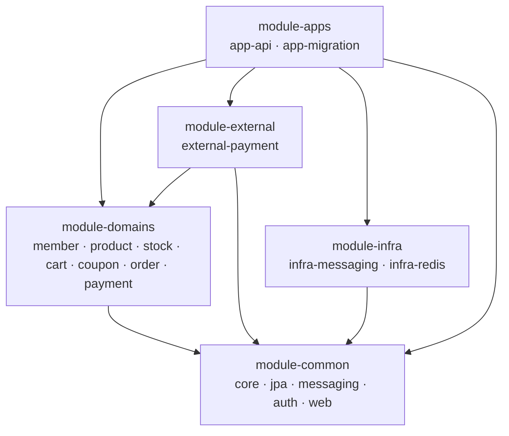

# Spring Boot Commerce


회원·상품·재고·장바구니·쿠폰·주문·결제 7개 도메인으로 구성한 커머스 백엔드입니다. Spring Boot 기반 모듈러 모놀리스로, 도메인 경계를 패키지 컨벤션이 아니라 Gradle 모듈 컴파일 의존성으로 강제합니다.

## 애플리케이션 이해하기

각 도메인은 독립 Gradle 모듈이며 다른 도메인을 컴파일 의존으로 참조하지 않습니다. 도메인 간 협력은 앱 계층의 파사드 조율과 도메인 이벤트로만 이어지고, 데이터베이스에도 크로스 도메인 FK를 두지 않습니다. 의존은 항상 한 방향으로만 흐릅니다.



모듈 구조와 설계 결정의 자세한 내용은 [`docs/architecture.md`](docs/architecture.md)를 참고하세요.

| 구분 | 기술 |
| --- | --- |
| 언어·프레임워크 | Java 25 · Spring Boot 4.1 |
| 데이터 | PostgreSQL 17 · Redis · Flyway · Spring Data JPA |
| 테스트·품질 | JUnit 5 · Testcontainers · ArchUnit · Spotless · NullAway · Error Prone |
| CI | GitHub Actions |

## 로컬에서 실행하기

```bash
git clone https://github.com/sangjaeoh/spring-boot-commerce.git
cd spring-boot-commerce
docker compose --profile full up -d --build --wait
```

PostgreSQL·Redis → 스키마 마이그레이션 → API 순서로 기동합니다. 앱 이미지를 컨테이너 안에서 빌드하므로 첫 실행은 수 분 걸립니다.

- API: `http://localhost:8080`
- API 문서(swagger-ui): `http://localhost:8080/swagger-ui.html`

## IDE에서 작업하기

코드를 수정하며 돌릴 때는 로컬 JVM으로 실행합니다. JDK 25와 Docker가 필요합니다.

1. PostgreSQL·Redis를 띄웁니다.

   ```bash
   docker compose up -d --wait
   ```

2. 스키마를 마이그레이션합니다. `app-migration`이 도메인 스키마마다 Flyway를 실행하고 종료합니다.

   ```bash
   ./gradlew :module-apps:app-migration:bootRun --args='--spring.profiles.active=local'
   ```

3. API 앱을 띄웁니다.

   ```bash
   ./gradlew :module-apps:app-api:bootRun --args='--spring.profiles.active=local'
   ```

IDE에서는 루트의 Gradle 프로젝트를 임포트하면 전 모듈이 함께 열립니다.

## 데이터베이스 구성

- PostgreSQL은 도메인마다 스키마 하나를 소유합니다. 스키마는 Flyway 마이그레이션이 소유하고, 앱은 기동 시 검증만 합니다.
- Redis는 멱등 키·로그인 레이트리밋·스케줄 스윕 분산 락(ShedLock) 저장소로 사용합니다.
- 호스트 포트는 로컬의 기존 서비스와 충돌하지 않도록 비표준 포트(PostgreSQL 55432 · Redis 56379)를 씁니다.
- 인메모리 DB는 쓰지 않습니다. 영속 테스트도 Testcontainers의 실제 PostgreSQL로 돌립니다.

## 빌드와 테스트

```bash
./gradlew build
```

빌드에 Spotless·NullAway·Error Prone·ArchUnit 게이트가 배선되어 있어, 포맷·null 계약·정적 분석·아키텍처 규칙 위반이 있으면 빌드가 실패합니다. 포맷 위반은 `./gradlew spotlessApply`로 자동 교정합니다.

## 더 알아보기

| 문서 | 내용 |
| --- | --- |
| [`docs/architecture.md`](docs/architecture.md) | 모듈·패키지 구조, 의존 방향, 빌드가 강제하는 불변식 |
| [`docs/coding-conventions.md`](docs/coding-conventions.md) | 타입 선언, 객체 생성·변환, 네이밍 |
| [`docs/entity-persistence.md`](docs/entity-persistence.md) | 엔티티 ID(UUIDv7), 버저닝, 연관 규칙 |
| [`docs/code-quality.md`](docs/code-quality.md) | Spotless·NullAway·Error Prone 게이트 |
| [`DOMAIN_MODEL.md`](DOMAIN_MODEL.md) | 도메인 모델 |
| [`REQUIREMENTS.md`](REQUIREMENTS.md) | 기능 요구사항 |
