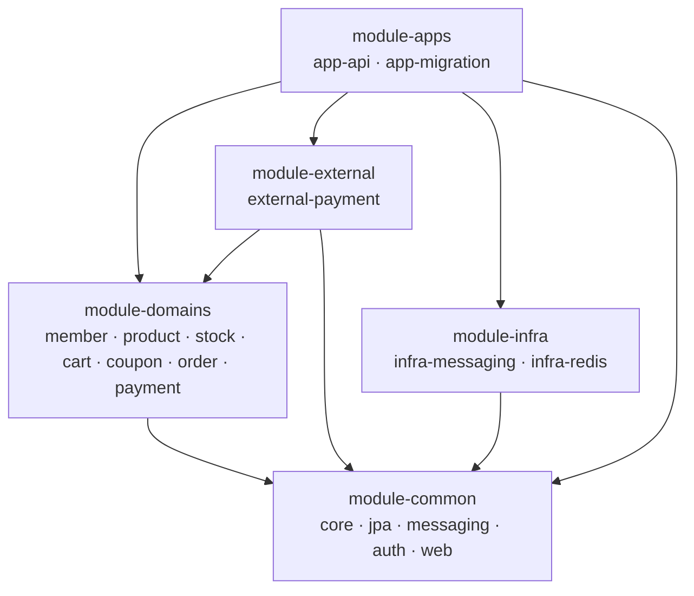

# Spring Boot Commerce

[](https://github.com/sangjaeoh/spring-boot-commerce/actions/workflows/build.yml)

7개 도메인(회원·상품·재고·장바구니·쿠폰·주문·결제)으로 구성한 커머스 백엔드다. Spring Boot 모듈러 모놀리스로, 도메인 간은 ID 값 참조와 앱 계층(파사드) 조율로만 잇는다 — 물리 FK·크로스 도메인 컴파일 의존이 없다. 결제는 동기 stub PG, 인증은 이메일+패스워드 로그인·JWT 액세스 토큰 발급까지다.

## 프로젝트 이해하기

핵심 설계 결정:

- **모듈러 모놀리스** — 도메인 경계를 Gradle 모듈 컴파일 의존성으로 강제한다. 단일 모듈 패키지 분리는 타 도메인 참조가 조용히 새므로 기각했다. 도메인이 비대해지면 내부 코드 수정 없이 독립 서비스로 분리하는 것이 목표다.
- **도메인별 PostgreSQL 스키마** — 도메인마다 스키마 하나를 소유해 크로스 도메인 조인·FK 유혹을 구조적으로 차단한다. 스키마는 Flyway가 소유하고 앱은 기동 시 검증만 한다(`ddl-auto: validate`).
- **경계 계약** — 모듈 내부는 엔티티, 경계는 불변 record(Info), 명령 반환은 ID다. OSIV를 끄고 엔티티가 경계를 넘지 않게 아키텍처 테스트가 막는다.
- **트랜잭션 경계** — 한 트랜잭션은 하나의 애그리거트만 변경한다. 파사드는 트랜잭션을 열지 않고, 크로스 도메인 조율은 도메인 이벤트 최종일관성으로 잇는다.
- **품질 게이트** — Spotless·NullAway·Error Prone·ArchUnit이 `./gradlew build`에 배선돼 있고, 같은 빌드를 GitHub Actions가 main 푸시·PR마다 원격 강제한다.

### 모듈 계층

의존은 항상 한 방향으로만 흐른다(앱 → 도메인·인프라 → 공용).



| 계층 | 모듈 | 역할 |
| --- | --- | --- |
| `module-apps` | `app-api` · `app-migration` | 실행 조립 — REST API 앱, 스키마 마이그레이션 앱 |
| `module-domains` | `domain-member` · `domain-product` · `domain-stock` · `domain-cart` · `domain-coupon` · `domain-order` · `domain-payment` | 도메인별 엔티티·서비스·리포지토리·Flyway SQL(`db/migration/{schema}/`) |
| `module-common` | `common-core` · `common-jpa` · `common-messaging` · `common-auth` · `common-web` | 공용 값 객체, JPA 기반(감사·마이그레이션 팩토리), 이벤트 발행 계약, JWT 발급·검증 원자재, 웹 경계(problem+json 핸들러·멱등·인증 필터) |
| `module-external` | `external-payment` | 결제 포트의 동기 stub PG 어댑터 |
| `module-infra` | `infra-messaging` · `infra-redis` | in-process 이벤트 발행 transport, Redis 멱등 키 저장소 |

의존 방향·패키지 규칙은 [`docs/architecture.md`](docs/architecture.md)가 소유한다.

## 기술 스택

| 구분 | 기술 |
| --- | --- |
| 언어·런타임 | Java 25 |
| 프레임워크 | Spring Boot 4.1 |
| 데이터 | PostgreSQL 17(도메인별 스키마) · Redis · Flyway · Spring Data JPA + QueryDSL |
| API 문서 | springdoc(swagger-ui) |
| 테스트·품질 | JUnit 5 · Testcontainers · ArchUnit · Spotless · NullAway · Error Prone |
| CI | GitHub Actions(`./gradlew build`) |

## 로컬 실행

요구 도구: Docker(Compose v2). 컨테이너 경로는 이것으로 충분하고, gradlew 경로는 JDK 25가 추가로 필요하다.

### 컨테이너 풀스택 — 명령 하나로 전체 기동

클론 직후 명령 하나로 postgres·redis → 마이그레이션(원샷) → API가 순서대로 뜬다(`http://localhost:8080`). 앱 이미지는 루트 `Dockerfile`(멀티스테이지 — 컨테이너 안에서 Gradle 빌드)로 compose가 빌드하므로 첫 실행은 의존성 다운로드로 수 분 걸린다.

```bash
git clone https://github.com/sangjaeoh/spring-boot-commerce.git
cd spring-boot-commerce
docker compose --profile full up -d --build --wait
```

### gradlew 실행 — 앱 코드를 수정하며 돌릴 때

이미지 재빌드 없이 로컬 JVM으로 앱을 돌린다(local 프로필, 호스트 포트 55432 datasource).

1. PostgreSQL·Redis를 띄운다(호스트 포트 55432·56379 — 로컬 기존 서비스와 충돌하지 않게 비표준 포트를 쓴다).

   ```bash
   docker compose up -d --wait
   ```

2. 스키마를 마이그레이션한다. `app-migration`이 7개 도메인 스키마 각각에 Flyway를 실행하고 종료한다.

   ```bash
   ./gradlew :module-apps:app-migration:bootRun --args='--spring.profiles.active=local'
   ```

3. API 앱을 띄운다(`http://localhost:8080`).

   ```bash
   ./gradlew :module-apps:app-api:bootRun --args='--spring.profiles.active=local'
   ```

API 문서(swagger-ui): `http://localhost:8080/swagger-ui.html` — 두 실행 경로 모두에서 열린다(로컬 외 기본 비노출).

## 스모크 테스트 — 가입 → 상품 등록 → 담기 → 체크아웃

앱을 띄운 채 다른 터미널에서 순서대로 실행한다(`curl`·`jq` 필요). 상품 등록은 관리자 전용이라 기동 시 시딩되는 로컬 관리자 계정(`admin@local.dev` — 컨테이너 경로는 compose 환경변수, gradlew 경로는 local 프로필 기본값)으로 로그인한다.

```bash
BASE=http://localhost:8080/api/v1

# 1. 회원 가입 + 로그인(구매자 토큰)
curl -s -X POST $BASE/members -H 'Content-Type: application/json' \
  -d '{"email":"buyer@example.com","name":"구매자","password":"buyer-password"}' > /dev/null
BUYER_TOKEN=$(curl -s -X POST $BASE/auth/login -H 'Content-Type: application/json' \
  -d '{"email":"buyer@example.com","password":"buyer-password"}' | jq -r .accessToken)

# 2. 관리자 로그인 후 상품 등록(첫 변형·초기 재고 시딩 포함), 변형 ID 조회
ADMIN_TOKEN=$(curl -s -X POST $BASE/auth/login -H 'Content-Type: application/json' \
  -d '{"email":"admin@local.dev","password":"local-admin-password"}' | jq -r .accessToken)
PRODUCT_ID=$(curl -s -X POST $BASE/products -H 'Content-Type: application/json' \
  -H "Authorization: Bearer $ADMIN_TOKEN" \
  -d '{"name":"티셔츠","description":"기본 티셔츠","price":19900,"options":[{"name":"색상","value":"검정"}],"initialQuantity":100}' \
  | jq -r .productId)
VARIANT_ID=$(curl -s $BASE/products/$PRODUCT_ID | jq -r '.variants[0].variantId')

# 3. 장바구니 담기(회원은 토큰 주체 — 본문에 memberId 없음)
curl -s -X POST $BASE/carts/items -H 'Content-Type: application/json' \
  -H "Authorization: Bearer $BUYER_TOKEN" \
  -d "{\"variantId\":\"$VARIANT_ID\",\"quantity\":2}"

# 4. 체크아웃(장바구니 전체 → 주문·결제). 더블서밋 방어용 멱등 키 헤더를 싣는다
ORDER_ID=$(curl -s -X POST $BASE/orders -H 'Content-Type: application/json' \
  -H "Authorization: Bearer $BUYER_TOKEN" \
  -H "Idempotency-Key: $(uuidgen)" \
  -d '{"shippingFee":3000,"method":"CARD",
       "shippingAddress":{"recipientName":"구매자","zipCode":"06236",
       "roadAddress":"서울 강남구 테헤란로 1","detailAddress":"101호","phone":"010-1234-5678"}}' \
  | jq -r .orderId)

# 5. 주문 확인 — status가 PAID면 성공
curl -s $BASE/orders/$ORDER_ID -H "Authorization: Bearer $BUYER_TOKEN" \
  | jq '{orderNumber, status, payAmount}'
```

## 관측성

노출 엔드포인트는 health뿐이다(metrics 등은 수집기가 없어 비노출). 콘솔 로그는 전 프로필에서 ECS(Elastic Common Schema) JSON 한 줄로 나간다.

```bash
curl -s http://localhost:8080/actuator/health            # {"status":"UP"}
curl -s http://localhost:8080/actuator/health/liveness   # 프로세스 생존
curl -s http://localhost:8080/actuator/health/readiness  # 트래픽 수용 가능

# 사람이 읽을 때는 jq를 거친다
./gradlew :module-apps:app-api:bootRun --args='--spring.profiles.active=local' | jq -R 'fromjson? // .'
```

## 테스트·빌드

```bash
./gradlew build
```

통합 테스트는 Testcontainers가 PostgreSQL·Redis를 직접 띄우므로 `docker compose` 기동 없이 돈다(Docker 데몬만 필요). 빌드에 Spotless·NullAway·Error Prone·ArchUnit 게이트가 포함되고, 같은 빌드가 [GitHub Actions](.github/workflows/build.yml)에서 main 푸시·PR마다 실행된다.

## 더 찾아보기

| 찾는 것 | 문서 |
| --- | --- |
| 무엇을 만드는가(범위·용어·오퍼레이션 요구) | [`REQUIREMENTS.md`](REQUIREMENTS.md) |
| 도메인 모델(엔티티·필드·상태·정책·불변식) | [`DOMAIN_MODEL.md`](DOMAIN_MODEL.md) |
| 모듈 구조·의존 방향·패키지 규칙 | [`docs/architecture.md`](docs/architecture.md) |
| 코딩 컨벤션 | [`docs/coding-conventions.md`](docs/coding-conventions.md) |
| 엔티티·영속성 규칙(UUIDv7·버저닝·연관) | [`docs/entity-persistence.md`](docs/entity-persistence.md) |
| 품질 게이트·도구 버전 | [`docs/code-quality.md`](docs/code-quality.md) |
| 다음 작업 목록 | [`todo.md`](todo.md) |
